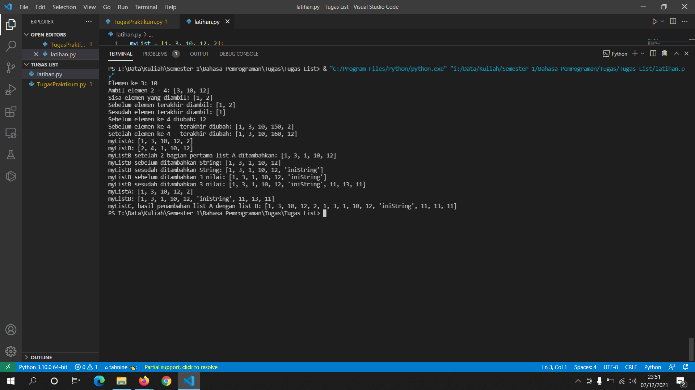
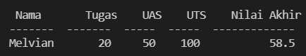
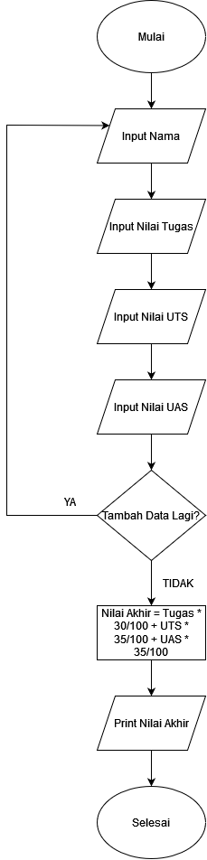

# <p align="center"> TUGAS PEMROGRAMAN - latihan.py & TugasPraktikum.py
[](https://www.linkedin.com/in/melvian-wijaya-760b371b1/)


<br>


# [latihan.py](https://github.com/melviandanuw/TugasKelilingLuasLingkaran/blob/main/tugas.py)

<p align="justify">Buat list dengan 5 elemen dan lakukan akses list, ubah elemen list dan tambah elemen list.

<B>Akses List</B>
- Buat List dengan 5 elemen.
```sh
myList = [1, 3, 10, 12, 2];
```
- Tampilkan elemen ke 3.
```sh
myList[2];
```
- Ambil elemen 2 - 4.
```sh
del myList[1:4];
```
- Ambil elemen terakhir.
```sh
myList.pop();
```

<B>Ubah Elemen</B>
- Ubah Elemen List ke 4.
```sh
myList[3] = 150;
```
- Ubah Elemen List ke 4 - terakhir
```sh
for i in range(3, len(myList)):
    myList[i] = myList[i] + 10;
```

<B>Tambah elemen list</B>
- Ambil 2 bagian pertama list A dan jadikan list B.
```sh
myListB[0:2] = myListA[0:2];
```
- Tambah list B dengan string.
```sh
myListB.append('iniString');
```
- Tambah list B dengan 3 nilai.
```sh
for i in range(0, 3):
    myListB.append(myListB[i] + 10);
```
- Menggabungkan list A dengan list B.
```sh
myListC = myListA + myListB;
```

----
# Hasil Output latihan.py


----

<br>

<br>

<br>

# [TugasPraktikum.py](https://github.com/melviandanuw/TugasKelilingLuasLingkaran/blob/main/tugas.py)

<p align="justify">Program membuat data sederhana.

- Buat variabel List.
```sh
data = [];
data2 = [];
listData = [];
```
- Looping menggunakan While dengan kondisi True.
```sh
while True
```
- Input data ke dalam list data.
```sh
    data.append(input("Masukan nama         : "));
    nilaiTugas = int(input("Masukan nilai Tugas  : "));
    data.append(nilaiTugas);
    nilaiUAS = int(input("Masukan nilai UAS    : "));
    data.append(nilaiUAS);
    nilaiUTS = int(input("Masukan nilai UTS    : "));
    data.append(nilaiUTS);
```
- Input Nilai Akhir dengan melakukan operasi aritmatika.
```sh
data.append(nilaiTugas * 30/100 + nilaiUAS * 35/100 + nilaiUTS * 35/100);

```
- Copy list Data lalu append ke listData.
```sh
       data2 = data.copy();
    listData.append(data2);
```
- Perkondisian jika Y akan menambahkan data lagi, jika N maka program berhenti, dan jika tidak Y/N maka inputan salah dan program akan berhenti.
```sh
 if addDatas.lower() == 'y':
        print('\nSilahkan masukan inputan kembali.');
    elif addDatas.lower() == 'n':
        print('\n', tabulate(listData, headers=["Nama", "Tugas", "UAS", "UTS", "Nilai Akhir"]));
        print("\nProgram akan berhenti.");
        break;
    else:
        print('\n', tabulate(listData, headers=["Nama", "Tugas", "UAS", "UTS", "Nilai Akhir"]));
        print("\nInputan Salah, Program akan berhenti.");
        break;
```
- Print hasil list menggunakan module Tabulate.
```sh
        print('\n', tabulate(listData, headers=["Nama", "Tugas", "UAS", "UTS", "Nilai Akhir"]));
```
# Hasil Output TugasPraktikum.py


# Flowchart TugasPraktikum.py


